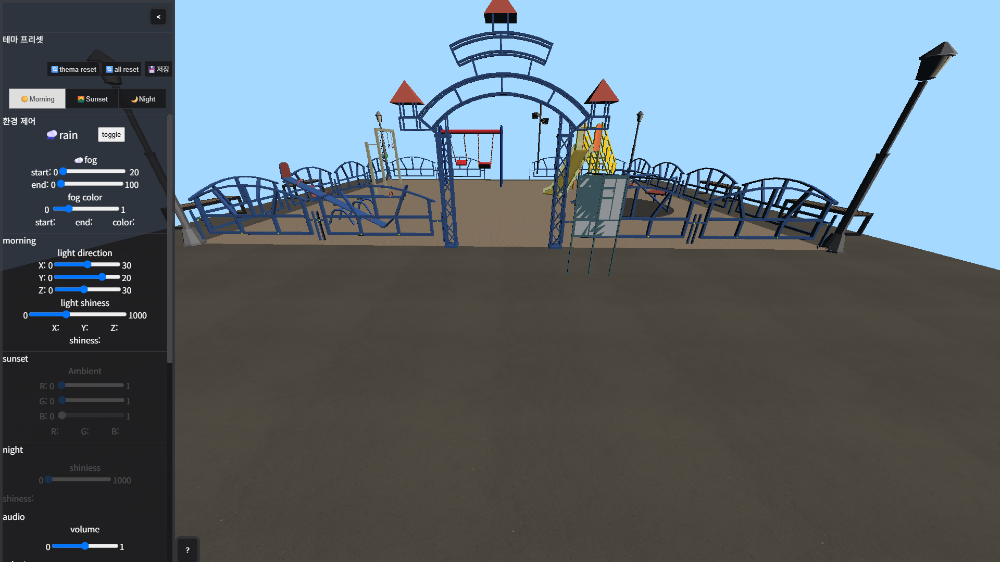

# 2026 WebGL playground-simulator
WebGL그래픽스 놀이터 시뮬레이터

## 프로젝트 개요
- 프로젝트명: playground-simulator
- 저장소명: 2026_Computer-graphics
- 성격: openGL기반 WebGL그래픽스 
- 개발 형태: JS기반 클라이언트 사이드 3D 그래픽스 렌더링
- 개발 인원: [@dbsckd4359]  https://github.com/dbsckd4359/2026_Computer-Graphics
- 개발 기간: before: 2026/06/01 ~ 2026/06/13 | after: 2026/07/21 ~ ing
- 핵심 목표:
     - WebGL 그래픽스 파이프라인 제어 및 이해
     - GLSL 셰이더를 통한 실시간 dynamic lighting 연산 구현 
     - 추가사항 구현
     - 사용자 인터렉션 컨텐츠 추가
     - 리팩토링 및 성능 최적화

 
## 핵심파일
  
  - `scripts/initShaders2.js` : GPU상에서 실행될 셰이더코드를 컴파일하고 링크하여 프로그램 활성화
  
  - `scripts/MV.js`: 행렬과 벡터 연산을 위한 유틸리티 파일
  
  - `shaders/fog_light_tex_vert.glsl`: 프로젝트 요소들의 정점의 위치와 좌표변환
  
  - `shaders/fog_light_tex_frag.glsl`: 픽셀의 최종 색상 결정 
 
  - `.gitignore`:오브젝트, 스크립트, 이미지 등 핵심 파일들을 제외한 불필요한 산출물 방지

## 설명
 배경은 놀이터이며, 각 기구 오브젝트를 클릭 시 기구 탑승이 가능하며 좌측 사이드바를 이용하여 테마에 대한 환경제어를 통해 커스텀 테마를 생성할 수 있습니다

## 테마프리셋 
### morning
  

### sunset
  

### night
  

## 프리뷰

## 기술
- HTML5 | CSS3 | JavaScript ES5 ES6| GLSL 
- Blender  

## 프로젝트 실행 
CG_Project.html파일을 브라우저로 열거나, vsCode의 Live Server 확장 프로그램을 사용하여 실행합니다 

## 사용 흐름
좌하단 ?버튼을 통한 사이드 패널 방식을 통하여 조작에 대한 설명을 볼 수 있으며 각 기구 오브젝트를 클릭하여 탑승이 가능합니다 추가로 사이드바의 환경제어를 통해 원하는 커스텀테마를 만들 수 있으며 초기 테마 설정에 어려움이 있을 경우
테마 프리셋의 `morning` `sunset` `night`모드를이 참조하여 유기적인 테마구성이 가능합니다

## 향후 추가사항
1. 가로등(LampObject)광원의 국소 조명 및 Emissive 적용 
  - LampObject의 발광 부위를 추출하여 fragment shader에서 Emissive 제어✓
  - 실제 빛이 분출되는 듯한 국소 Lighting구현(specular 및 Blinn Model 적용) ✓ 

2. 마우스피킹(picking) 기반의 놀이터 기구에 대한 동적 카메라 뷰 전환 
    - 기구 탑승이 가능한 애니메이션 구현 ✓
	  - 기구들의 시점 설정 ✓
	  - 사용자 인터렉션을 위한 요소 추가 후 picking과 동기화 ✓
       ※object picking에 대한 버튼 활성화 좌표 구현 
	  - 하차를 위한 로직 추가 ✓

3. 오브젝트 국소 회전 애니메이션 구현 
  - 놀이터 기구 오브젝트의 모델 변환 행렬 독립제어를 통한 부분 회전 애니메이션 구현 ✓
 
4. 사용자 인터랙션을 위한 사이드바 컨텐츠 요소 추가
  - siren(borded speaker 대체)클릭시 mp3, mp4 등 오디오 변환 ✓ 
    - 시점 거리에 따른 음향 조절
  - 환경제어(공통)
    - fog ✓
    - rain(Particle)애니메이션 구현
  - 테마 프리셋 및 커스텀 테마 만들기(sider기반)
    - 커스텀 테마 저장 및 불러오기 

## 정리
현 프로젝트는 WebGL 파이프라인에 대한 이해와 학습을 위해 라이브러리(three.js)없이 직접 파이프라인을 구축 했으며, AI 코드를 지양하고 행렬•벡터 연산을 위해 제공되는 유틸리티(MV.js)활용 및 수학적 레퍼런스만 참조한 프로젝트입니다. 
처음에는 `childhood-recollection` 이라는 컨셉으로 시작했으나, 기능을 고도화할수록 유기적인 상호작용이 필요해지며
시뮬레이터(simulator)으로 발전하게 되었습니다 이 과정에서 확장성을 고려한 초기 아키텍처 구축과 설계의 중요성을 알 수 있었습니다.   
